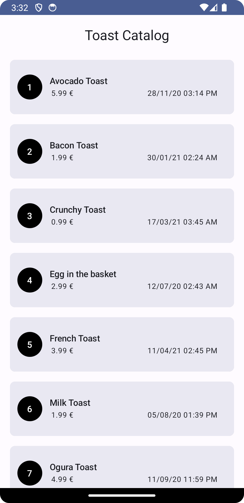

# Toast Catalog

It is a sample app that shows data
from [API](https://my-json-server.typicode.com/sumup-challenges/mobile-coding-challenge-data/items/)

## Screenshot



### Prerequisites

Use the latest Android Studio Hedgehog | 2023.1.1 Patch 1.
App compile sdk and target sdk is 34 with min sdk 28

### App Architecture

App is using Clean Code Architecture with single module and MVVM for presentation layer.
The app is very small and simple containing only one feature with on screen, that it why I choose to
go with single module to reduce unnecessary complexity but the app is separated into packages with
scalability in-mind (Modularization is one step away), once more features are required the packages
can move in its own module.

#### Packages Structure

All these packages can be moved to their own modules when the app scales-up to help develop other
features faster and easier.

##### Network package

Contain all basic networking setup(Retrofit, OkHttp and Kotlinx Serialization Json), using hilt to
inject these dependencies.

#### Design System Package

Contain all design system theming and component for Toast Catalog App.

- Theming like colors, typography and app theme.
- Base Design Component that can be used in different screens and features:
    - error snackbar.
    - circle with text
    - full screen loading.
    - loading item that can be used in the ind of list.
    - top app bar.

#### Common Package

containing extensions function and interfaces that can be used by any feature.

- DateExtensions: date conversion function that convert:
    - date from server string to LocalDateTime that can be use in business logic
    - from LocalDateTime to user readable string format.
- Mapper interface that can be use to map models from one layer to another if needed.

#### Toasts Package (Feature Package)

Toasts containing 3 packages for all 3 architecture layers, when app scale-up this can be moved to
its own module or spilt to 2 or 3 modules depending on future needs and dependencies between
features. I will explain below App Architecture and design decisions.

- Data Layer: contain all data accessing code as this layer is responsible for providing data
    - Toasts DTO.
    - fetching toasts catalog from API.
    - prepare data and flows.
    - mapping Toasts DTO to Toast model.
    - Repository implementation
    - data source (internal & external) should be a part of data layer
- Domain (Business) Layer: contain all business logic.
    - contract with data layer.
    - usecase for the business use cases.
    - Toast model(Entity).
- Presentation Layer: This layer is responsible for drawing UI and it is using MVVM architecture
    - ViewModel is responsible of executing usecase that provide data to the user or to execute
      user/app events.
    - Compose is Used to show UI.
    - All UI related logics exists here and holding states
    - UI Data models and Mappers
    - Composable Screens
    - ViewModel is responsible for creating immutable state for the ui and hold them. I use stateflow for states. Stateflow is used for immutable view state which is collect as compose state in the screen. Stateflow can repeat last item whenever there is a new subscribe. That is why it is the best option for holding state and after the configuration changes(screen rotation, theme change, language change etc.) it can provide the last state. The error events are also part of the view state as they are view model events.

### External Library used

- Hilt: for dependency injection
- Compose: for UI
- Coroutines (flow): for concurrency/asynchronous work
- Retrofit: for networking
- Kotlinx Serialization: for model serialization/deserialization
- Jetpack Paging 3: for handling pagination
- MockK: for mocking dependencies in unit test
- turbine: for Coroutine flow testing
- detekt: for analyzing, improving and maintaining kotlin code by enforcing rule sets

### Tools

- Kover: test coverage tool to make sure that the unit test covers all business code.
    - run ```koverHtmlReportDebug``` to generate coverage report, coverage report can be found under
      app/build/coverageReport/index.html
- Detekt: a static code analysis tool to make sure that the code style is kept clean and readable.
    - run ```detekt``` gradle task to analysis the code
